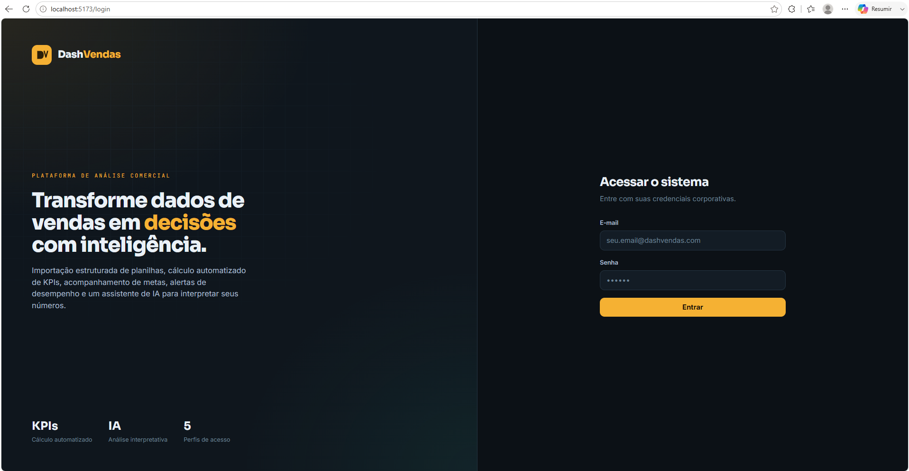
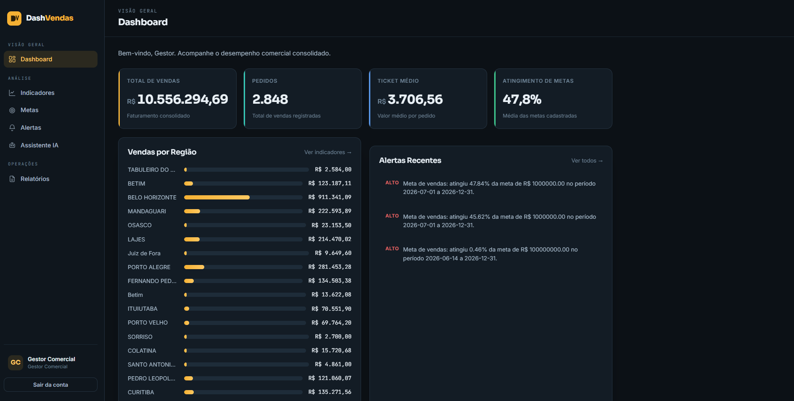
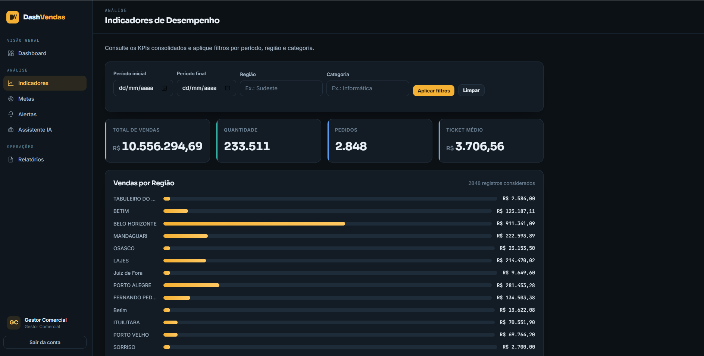
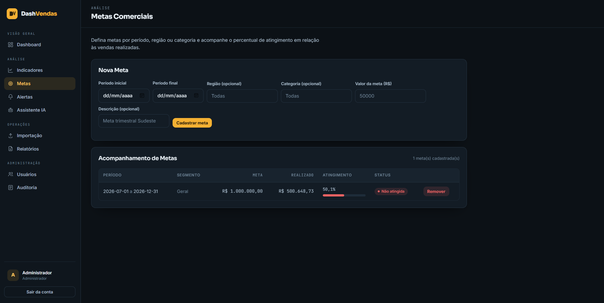
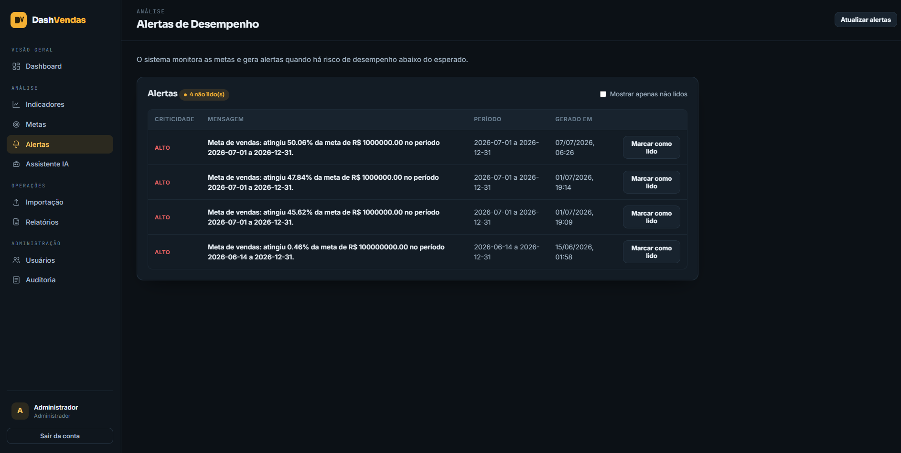
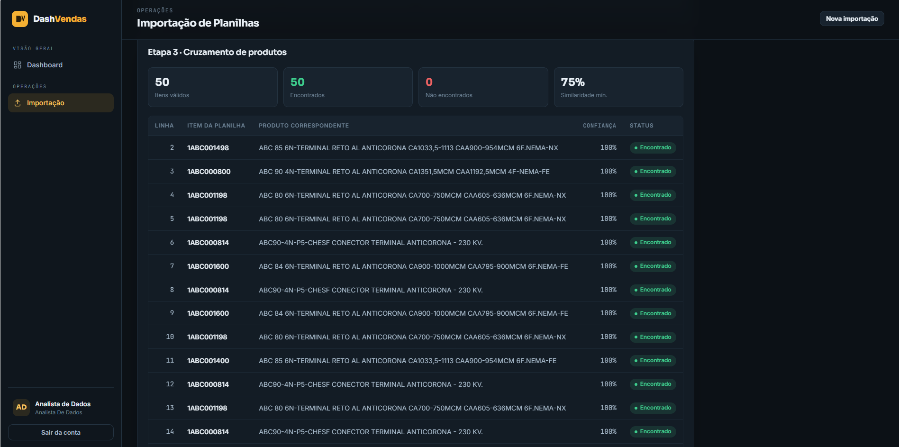
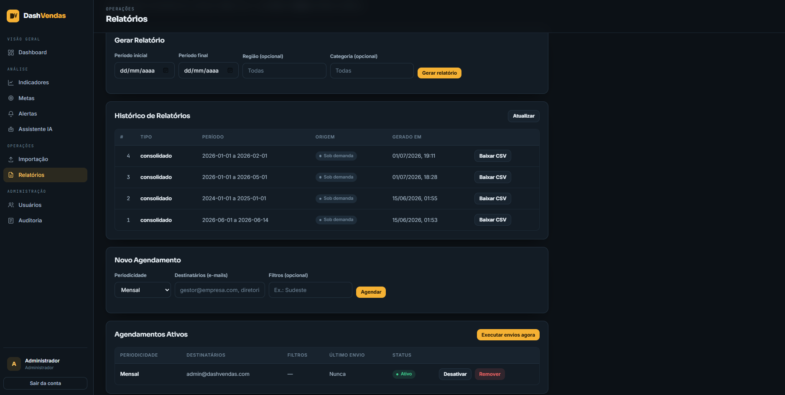
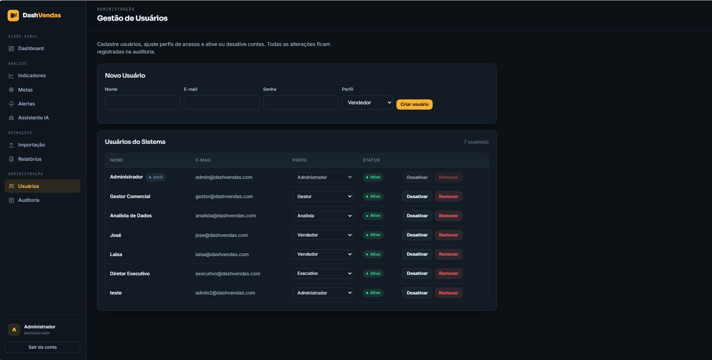
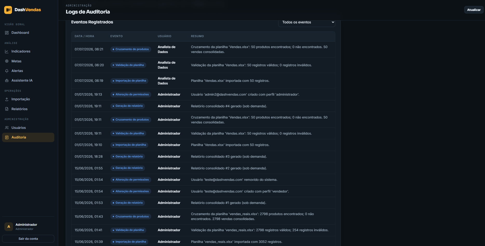

# Manual do Usuário — DashVendas

> Guia de uso do sistema DashVendas, plataforma de análise comercial com
> importação de planilhas, cálculo de indicadores (KPIs), acompanhamento de
> metas, alertas automáticos, relatórios e assistente de Inteligência Artificial.

---

## Sumário

- [1. Acesso ao sistema](#1-acesso-ao-sistema)
- [2. Perfis de usuário](#2-perfis-de-usuário)
- [3. Tela inicial (Dashboard)](#3-tela-inicial-dashboard)
- [4. Indicadores (KPIs)](#4-indicadores-kpis)
- [5. Metas](#5-metas)
- [6. Alertas](#6-alertas)
- [7. Importação de planilhas](#7-importação-de-planilhas)
- [8. Assistente de IA](#8-assistente-de-ia)
- [9. Relatórios](#9-relatórios)
- [10. Meu desempenho (vendedor)](#10-meu-desempenho-vendedor)
- [11. Gestão de usuários (administrador)](#11-gestão-de-usuários-administrador)
- [12. Auditoria (logs)](#12-auditoria-logs)
- [13. Perguntas frequentes](#13-perguntas-frequentes)

---

## 1. Acesso ao sistema

1. Abra o navegador e acesse o endereço do sistema (por padrão, em ambiente
   local: `http://localhost:5173`).
2. Na tela de login, informe seu **e-mail corporativo** e sua **senha**.
3. Clique em **Entrar**.

Caso as credenciais estejam incorretas, o sistema exibirá uma mensagem de erro.
Em caso de esquecimento de senha, procure o administrador do sistema.

---

## 2. Perfis de usuário

O sistema possui controle de acesso por perfil. Cada perfil enxerga apenas as
funcionalidades pertinentes à sua função:

| Perfil | O que pode fazer |
|---|---|
| **Administrador** | Acesso total, incluindo gestão de usuários e permissões. |
| **Gestor comercial** | Dashboard, indicadores, metas, alertas e relatórios. |
| **Analista de dados** | Importação, validação e cruzamento de planilhas; auditoria. |
| **Vendedor** | Consulta ao próprio desempenho individual. |
| **Usuário executivo** | Indicadores e assistente de IA para análises. |

O menu lateral exibe apenas as opções permitidas ao perfil que está autenticado.

---

## 3. Tela inicial (Dashboard)

Após o login, o sistema apresenta o **Dashboard**, com uma visão geral do
desempenho comercial:

- **Cartões de indicadores** no topo: total de vendas, número de pedidos, ticket
  médio e atingimento de metas.
- **Vendas por região**: gráfico com o ranking das regiões por faturamento.
- **Alertas recentes**: notificações sobre metas em risco ou não atingidas.

Use o menu lateral esquerdo para navegar entre as seções.

---

## 4. Indicadores (KPIs)

A tela **Indicadores** apresenta os KPIs consolidados, calculados em tempo real
a partir das vendas registradas:

- Faturamento total, quantidade de pedidos e ticket médio.
- Distribuição por **região** e por **categoria** de produto.

Você pode aplicar **filtros** (período, região, categoria) para recalcular os
indicadores conforme o recorte desejado.

> Os indicadores são derivados dinamicamente das vendas — sempre refletem o
> estado atual da base de dados.

---

## 5. Metas

Na tela **Metas**, o gestor pode:

1. **Cadastrar uma nova meta**, informando período (início e fim), região,
   categoria e o valor da meta.
2. **Acompanhar o atingimento** de cada meta, com o percentual alcançado e a
   classificação de status:
   - **Atingida** — meta cumprida.
   - **Em risco** — atingimento parcial, entre 70% e 100%.
   - **Não atingida** — abaixo de 70%.

Ao salvar uma meta, ela passa a ser considerada automaticamente no cálculo de
alertas.

---

## 6. Alertas

A tela **Alertas** lista as notificações geradas automaticamente pelo sistema a
partir da análise das metas:

- Alertas de **criticidade alta** (metas muito abaixo do esperado).
- Alertas de **criticidade média** (metas em risco).

Os alertas não são cadastrados manualmente: o sistema os gera com base nas metas
em risco ou não atingidas. É possível marcar um alerta como lido.

---

## 7. Importação de planilhas

A importação é feita em **três etapas**, na tela **Importação** (perfil analista):

### Etapa 1 — Importar
1. Clique em **Escolher arquivo** e selecione a planilha Excel (.xlsx).
2. Clique em **Importar**. O sistema lê o arquivo e registra a importação.

### Etapa 2 — Validar
O sistema valida cada linha automaticamente, verificando:
- Campos obrigatórios preenchidos;
- Valores numéricos válidos (quantidade e valores);
- Consistência entre quantidade, valor unitário e valor total;
- Registros duplicados dentro da própria planilha.

Linhas com problema são marcadas como **inválidas**, com a descrição do erro.

### Etapa 3 — Cruzar produtos
O sistema associa cada item da planilha a um produto do catálogo interno, por
**código** ou por **similaridade textual**, indicando o nível de confiança do
cruzamento. Ao final, as vendas são consolidadas na base.

> Todas as etapas registram logs de auditoria, disponíveis na tela de Auditoria.

---

## 8. Assistente de IA

A tela **Assistente de IA** permite fazer perguntas em linguagem natural sobre o
desempenho comercial e obter análises interpretativas:

1. Digite uma pergunta (ex.: "Qual a melhor região em vendas?") ou use um dos
   atalhos sugeridos.
2. Clique em **Enviar**. O assistente responde com base nos dados do sistema.
3. Para uma visão geral, use o botão **Gerar análise geral**.

> O assistente funciona com um provedor externo de IA quando configurado, ou em
> **modo local** (a partir dos próprios dados) quando não há chave de API.

---

## 9. Relatórios

Na tela **Relatórios**, é possível:

- **Gerar um relatório** consolidado por período e filtros, para visualização ou
  download.
- **Agendar relatórios periódicos**, informando a periodicidade e os
  destinatários. Os relatórios agendados são enviados automaticamente pelo
  sistema nos intervalos definidos.

---

## 10. Meu desempenho (vendedor)

O perfil **Vendedor** tem acesso à tela **Meu desempenho**, que apresenta os
indicadores individuais do vendedor autenticado:

- Total de vendas, quantidade de pedidos e ticket médio pessoal.
- Vendas por categoria.

Cada vendedor visualiza apenas os próprios resultados.

---

## 11. Gestão de usuários (administrador)

O perfil **Administrador** acessa a tela **Usuários**, onde pode:

- Cadastrar novos usuários, definindo nome, e-mail, perfil e senha inicial.
- Ativar ou desativar usuários.
- Ajustar permissões (perfil de acesso).

---

## 12. Auditoria (logs)

A tela **Auditoria** centraliza o histórico das operações realizadas no sistema
(importações, validações, cruzamentos e envios), com data, tipo de operação e
usuário responsável. Serve para rastreabilidade e conformidade.

---

## 13. Perguntas frequentes

**Não consigo entrar no sistema.**
Verifique se o e-mail e a senha estão corretos. Se o problema persistir, peça ao
administrador para conferir se seu usuário está ativo.

**Não vejo algumas telas do menu.**
O menu exibe apenas as funcionalidades permitidas ao seu perfil. Perfis
diferentes têm acessos diferentes (ver seção 2).

**Os indicadores estão zerados.**
Os KPIs dependem de vendas na base. Se ainda não houve importação de planilhas,
não haverá dados para calcular. Importe uma planilha primeiro (seção 7).

**Importei uma planilha, mas alguns itens ficaram inválidos.**
Isso é esperado quando há campos ausentes, valores inconsistentes ou registros
duplicados. Consulte a mensagem de erro de cada item na etapa de validação,
corrija a planilha e importe novamente.

**O assistente de IA respondeu "via modo local".**
Significa que não há um provedor externo de IA configurado no momento. O sistema
gera a resposta a partir dos próprios dados, sem prejuízo às informações.

---

*Manual do Usuário — Sistema DashVendas. Trabalho de Conclusão de Curso,
Engenharia de Software, PUC Minas.*
